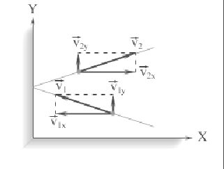

# Модель идеального газа.

Под идеальным газом мы будем понимать газ, для которого:  радиус взаимодействия двух молекул много меньше среднего расстояния между ними (взаимодействуют только при столкновении);  столкновения молекул между собой и со стенками сосуда абсолютно упругие (выполняются законы сохранения энергии и импульса);  объем всех молекул газа много меньше объема, занятого газом. Рассмотрим подробнее, что представляет собой один из основных параметров состояния – давление Р. Еще в XVIII в. Даниил Бернулли предположил, что давление газа есть следствие столкновения газовых молекул со стенками сосуда. Именно давление чаще всего является единственным сигналом присутствия газа.
Итак, находящийся под давлением газ или жидкость действует с некоторой силой на любую поверхность, ограничивающую его объем. В этом случае сила ∆F действует по нормали к ограничивающей объем поверхности ∆S. Давление на поверхность $P=∆F/∆S$.

Можно также говорить о давлении внутри газа или жидкости. Его можно измерить, помещая в газ или жидкость небольшой куб с тонкими стенками, наполненный той же средой.

Поскольку среда покоится, на каждую грань куба со стороны среды действует одна и та же сила ∆F. В окрестности куба давление равно $∆F/∆S$, где ∆S-площадь грани куба. Из этого следует, что внутреннее давление является одним и тем же во всех направлениях и во всем объеме, независимо от формы сосуда. Этот результат называется законом Паскаля: если к некоторой части поверхности, ограничивающей газ или жидкость, приложено давление Р, то оно одинаково передается любой части этой поверхности.

   Модель идеального газа достаточно хорошо описывает поведение
реальных газов в широком диапазоне давлений и температур. Задача
молекулярно-кинетической теории состоит в том, чтобы установить связь
между микроскопическими (масса, скорость, кинетическая энергия молекул)
и макроскопическими параметрами (давление, газ, температура).

   В результате каждого столкновения между молекулами и молекул со
стенкой скорости молекул могут изменяться по модулю и по направлению;
на интервалах между последовательными столкновениями молекулы
движутся равномерно и прямолинейно.

   Используя модель идеального газа, вычислим давление газа на стенку
сосуда. В процессе взаимодействия молекулы со стенкой сосуда между ними
возникают силы, подчиняющиеся третьему закону Ньютона. В результате
проекция υx скорости молекулы, перпендикулярная стенке, изменяет свой
знак на противоположный, а проекция υy скорости, параллельная стенке,
остается неизменной.

   В результате многочисленных соударений молекул газа между собой и
со стенками в сосуде, содержащем большое число молекул, устанавливается
некоторое статистическое распределение молекул по скоростям. При этом
все направления векторов скоростей молекул оказываются равноправными
(равновероятными), а модули скоростей и их проекции на координатные оси
подчиняются определенным закономерностям. Распределение молекул газа
по модулю скоростей называется распределением Максвелла (1860 г.).

   В основное уравнение молекулярно-кинетической теории газов входит
произведение концентрации молекул n на среднюю кинетическую энергию
поступательного движения. Если предположить, что газ находится в сосуде
неизменного объема V, то (N – число молекул в сосуде). В этом случае
изменение давления Δp пропорционально изменению средней кинетической
энергии.

   Возникают вопросы: каким образом можно на опыте изменять среднюю
кинетическую энергию движения молекул в сосуде неизменного объема?
Какую физическую величину нужно изменить, чтобы изменилась средняя
кинетическая энергия? Такой величиной в физике является температура.